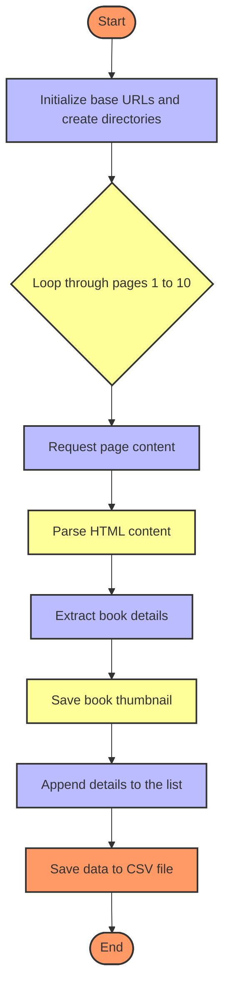

# Books to Scrape Web Scraper


This project contains a web scraper that extracts data from the website [Books to Scrape](https://books.toscrape.com/). The scraper gathers information about books, including titles, prices, availability, ratings, and thumbnails, and saves the data in a CSV file. Thumbnails are also downloaded and saved locally.

## Features

- Scrapes book details including title, price, availability, rating, and thumbnail URL.
- Downloads and saves thumbnail images locally.
- Saves extracted data to a CSV file in a structured format.
- Processes the first 10 pages of the website.

## Requirements

- Python 3.8+
- BeautifulSoup 4.9.3+
- pandas 1.2.0+
- requests 2.25.1+


## Installation

1. Clone the repository:

    ```sh
    git clone https://github.com/your-username/books-to-scrape-web-scraper.git
    cd books-to-scrape-web-scraper
    ```

2. Create a virtual environment:

    ```sh
    python -m venv venv
    source venv/bin/activate  # On Windows, use `venv\Scripts\activate`
    ```

3. Install the required packages:

    ```sh
    pip install -r requirements.txt
    ```

## Usage

1. Run the scraper script:

    ```sh
    python scrape_books.py
    ```

2. The script will extract data from the first 10 pages of the website, save the data to a CSV file located in the `data_sheet` directory, and download thumbnails to the `images` directory.

## Output

- `data_sheet/books_data.csv`: Contains the scraped book details.
- `images/`: Contains the downloaded thumbnail images.

## Video
For a detailed tutorial on how to use this script, please refer to the [Books to Scrape 📚](https://www.youtube.com/watch?v=SROnFyxGVJM).
[](https://www.youtube.com/watch?v=SROnFyxGVJM)

## Directory Structure
To help organize your project, here's a suggested directory structure:

```
books-to-scrape-web-scraper/
├── data_sheet/
│   └── books_data.csv
├── images/
│   └── (thumbnails)
├── scrape_books.py
├── requirements.txt
└── README.md
```


